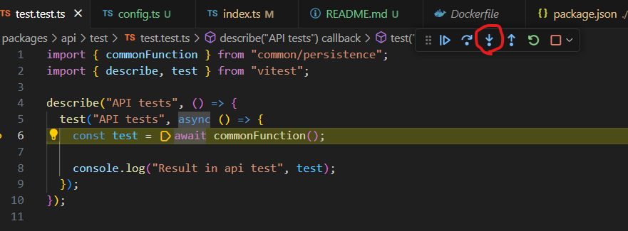
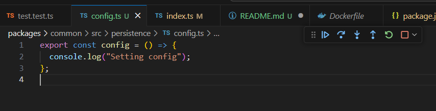

# Environment

Node:

```
Node 20
pnpm 8.15.2
```

VSCode:

```
Version: 1.88.0 (user setup)
Commit: 5c3e652f63e798a5ac2f31ffd0d863669328dc4c
Date: 2024-04-03T13:26:18.741Z
Electron: 28.2.8
ElectronBuildId: 27744544
Chromium: 120.0.6099.291
Node.js: 18.18.2
V8: 12.0.267.19-electron.0
OS: Windows_NT x64 10.0.22631
```

# Bug description

When debugging tests from a top-level package with vitest, the code withing the common package (workspace dependency) is not mapped properly. Breakpoints and debugging pointers are not shown on the right files and lines of the TypeScript files.





# Setup repo

1. If using the devcontainer (recommended), skip this step. Else, install pnpm `npm install -g pnpm@8.15.2`
2. From the root, install and build: `pnpm u`

# Steps to reproduction

1. Go to the API test file: `./packages/api/test/test.test.ts`
2. Set a breakpoint on line 6
3. Run the "Debug API Test File" from the debug launcher
4. Step into the `commonFunction` function.
5. Pointer is at the wrong place

# Scenarios that work

## Debugging with tsx

1. Go to the API file: `./packages/api/src/listen.ts`
2. Set a breakpoint on line 7
3. Run the "Debug API Service" from the debug launcher
4. Step into the `commonFunction` function.
5. Pointer is at the right place

## Changing code in common

1. Comment line 3 in file `packages/common/src/persistence`
2. Rebuild the repo with `pnpm u`
3. Go to the API test file: `./packages/api/test/test.test.ts`
4. Set a breakpoint on line 6
5. Run the "Debug API Test File" from the debug launcher
6. Step into the `commonFunction` function.
7. Pointer is at the right place
